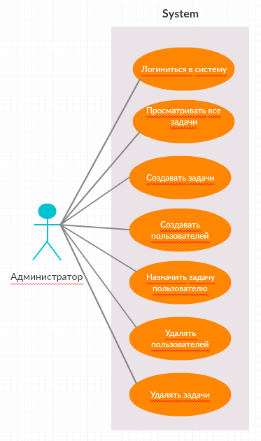
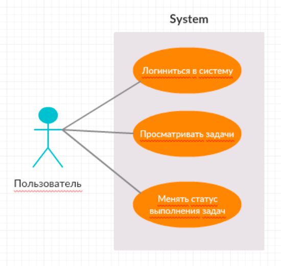
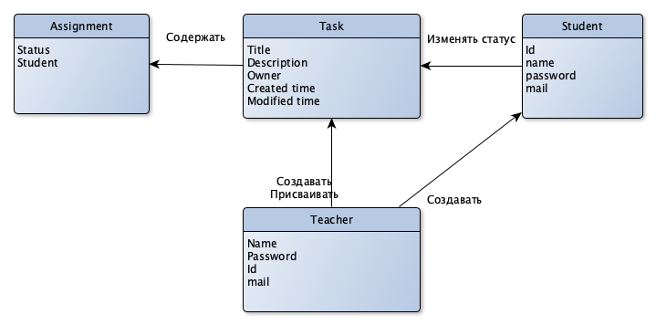
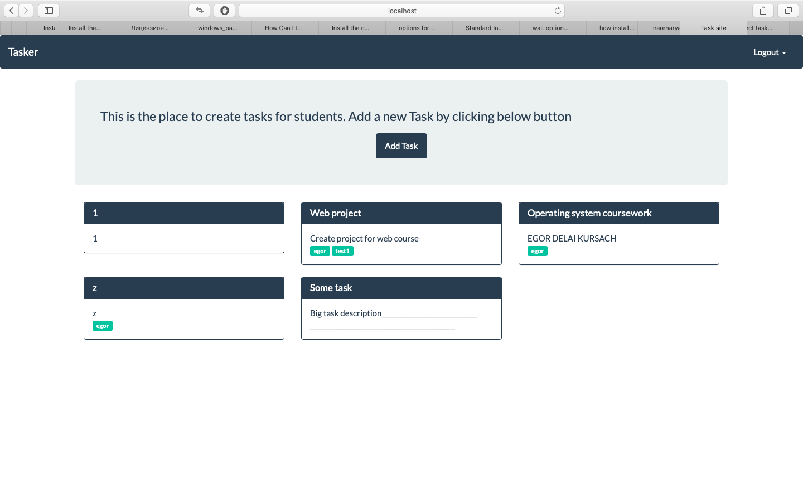
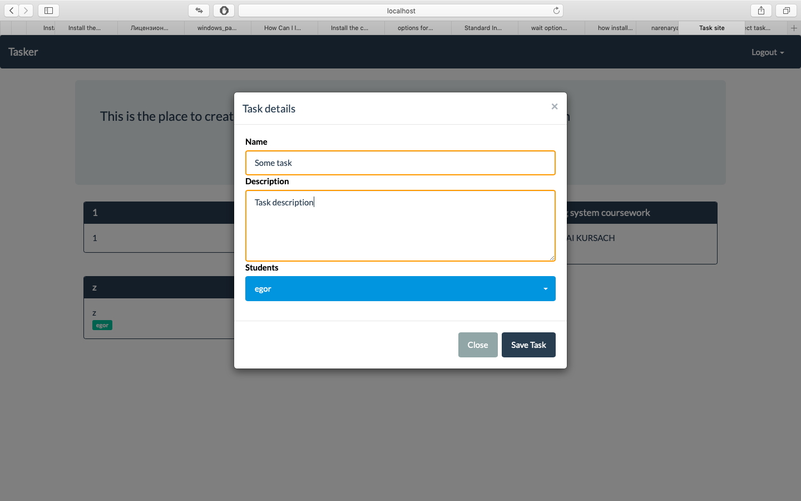
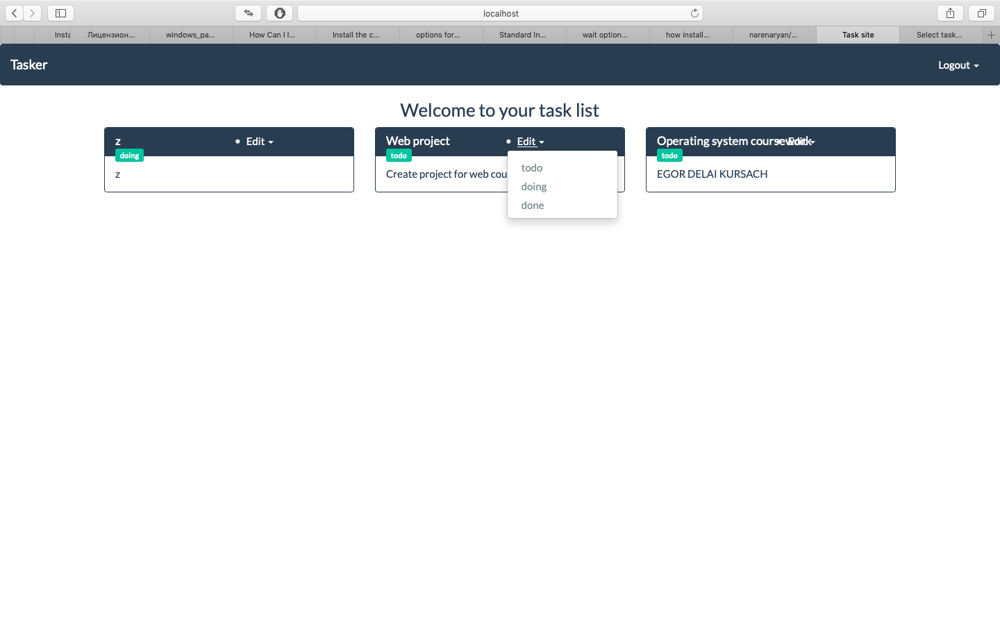

# 1. Название проекта
Jira_for_Homeless.

Преподаватеско-студенческий менеджер задач.

# 2. Краткое описание проблемной области и актуальности

## Проблемная область.

Порой трудно держать в голове все задачи, которые ты поручил студентам.
Также не всегда удобно опрашивать студентов о статусе выполения их задач.
Jira это слишком сложно и дорого для тебя.

## Как решаем

Решение состоит в построеннии системы распределения задач между студентами.
Небходимо реализовать регистрацию пользователей, создания задач и присвоения
задач соответстующим пользователям.

# 3. Описание ролей пользователя
## Use-case диаграмма

## Назначение ролей пользователя
- Пользователь (студент) -- обычный юзер
- Админ (преподаватель) -- юзер с дополнительными привилегиями: может создавать,
удалять юзеров и таски.

# 4. Сущности предметной области

# 5. Прототип интерфейса

Страница преподавателя

Страница создания

Основная страница

# 6. Архитектура приложения

# 7. Выбор Backend- и Frontend-стеков

### Backend:

Web-сервер - Django (Язык программирования - Python)
База данных - PostgeSQL

### Frontend:

Boostrap
